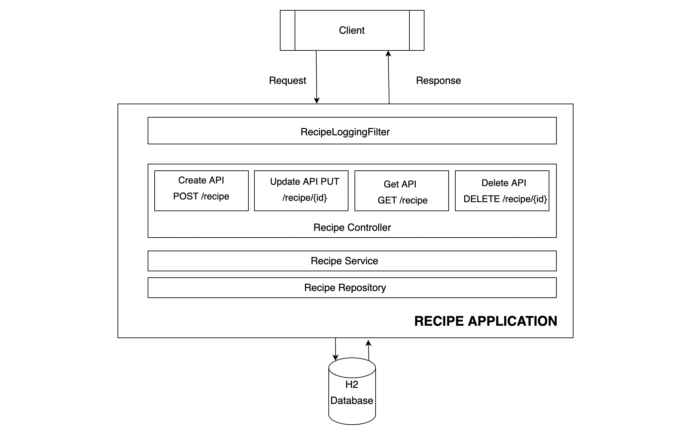
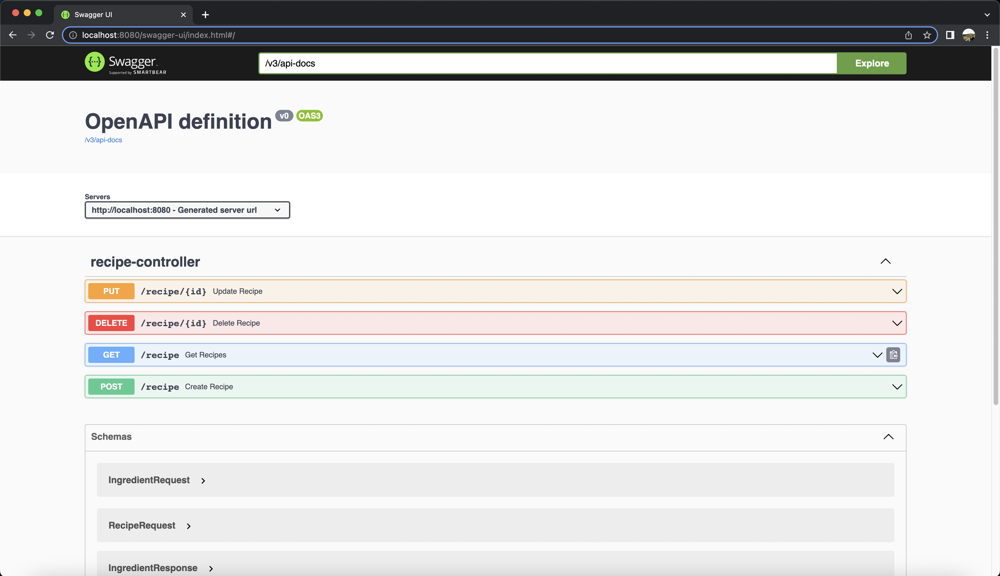

# **RECIPE APPLICATION**

Recipe Application includes four APIs to create, list, update and delete recipe. H2, in memory database is used for storing. Dynamic search is used for listing according to dish type, cooking instruction, portion size and ingredients. Hibernate is used for JPA implementation. Javax validations and annotations are used for validation. Errors are caught at the controller level by controller advice. Criteria Builder is used for filtering recipes when listing.

 

## **Technology Stack**

* Java 17
* Maven
* Spring Boot 2.7.3
* Lombok
* Mapstuct for mapping
* H2 database
* Springdoc for Swagger 3 Api Documentation
* Junit
* Hibernate
* JPA
* Docker

## **Getting Started**

1. Clone the repository from https://github.com/OzgeDuranErcetin/recipe.git
2. Import project in IDE
3. Choose the SpringBootApplication in this project RecipeApplication.java
4. Right click on the file and select Run application

## **Build and run project**

```
    mvn clean install
    java -jar target/recipe-0.0.1-SNAPSHOT.jar
```

## **Run with Docker**

```
    mvn clean install
    docker-compose up --build
 ```   


## **Usage**

There are four APIs on Recipe Application

### **Test with Swagger**

http://localhost:8080/swagger-ui/index.html 

 

 ### **H2 Database Engine console**

 http://localhost:8080/h2-console

### **Api Usage**

*  Post `/recipe`

The POST **recipe** API creates a recipe. It saves the recipe to the database after checking the validations.

Example of post request body for `/recipe`

```
{
  "dishName": "steak",
  "dishType": "meat",
  "portionSize": 1,
  "cookingInstructions": "season steak with salt and pepper and cook steak on pan",
  "ingredients": [
    {
      "name": "steak"
    },
    {
      "name": "salt"
    },
    {
      "name": "pepper"
    }
  ]
}
```

Example of response

```
{
  "id": 1,
  "dishName": "steak",
  "dishType": "meat",
  "portionSize": 1,
  "cookingInstructions": "season steak with salt and pepper, cook steak on pan",
  "createDate": "2022-09-07T18:34:09.540+00:00",
  "ingredients": [
    {
      "id": 1,
      "name": "steak"
    },
    {
      "id": 2,
      "name": "salt"
    },
    {
      "id": 3,
      "name": "pepper"
    }
  ]
}
```

*  Put `/recipe/{id}`

The PUT **recipe** API updates the recipe for id given from path. It updates the recipe to the database after checking the validations.

Example of put request body for `/recipe/1`

```
{
  "dishName": "onion soup",
  "dishType": "Vegetarian",
  "portionSize": 4,
  "cookingInstructions": "cut onions, heat the water, cook them together in pot and oven them",
  "ingredients": [
    {
      "name": "onion"
    },
    {
      "name": "water"
    }
  ]
}
```
*  Delete `/recipe/{id}`

The DELETE **recipe** API deletes the recipe for id given from path.

Example of delete for `/recipe/1`

```
curl -X 'DELETE' \ 'http://localhost:8080/recipe/1' \  -H 'accept: */*'
```

*  Get `/recipe`

The GET **recipe** gets filtered with pageable recipes. Criteria Builder is used for dynamic query. 

Examples of get

```
curl -X 'GET' \ 'http://localhost:8080/recipe?page=0&size=10' \ -H 'accept: application/json'

curl -X 'GET' \ 'http://localhost:8080/recipe?dishType=meat&page=0&size=10' \ -H 'accept: application/json'

curl -X 'GET' \ 'http://localhost:8080/recipe?dishType=vegetarian&ingredientInclude=water&portionSize=4&cookingInstructionsLike=oven&page=0&size=10' \
  -H 'accept: application/json'
```


## **Logging**

Logback is used for logging request and response. Filters used for logging. Log depends on a property. You should add the below property in application.yaml for open request and response logging.

```
recipe:
  logging:
    enabled: true
```
Example of a log for single Request/Respone

```
 {"id":"c110c4f4-6b76-4dcf-b24b-37f2b2039821","method":"POST","url":"/recipe","request":"{\n  \"dishName\": \"onion soup\",\n  \"dishType\": \"Vegetarian\",\n  \"portionSize\": 4,\n  \"cookingInstructions\": \"cut onions, heat the water, cook them together in pot and oven them\",\n  \"ingredients\": [\n    {\n      \"name\": \"onion\"\n    },\n    {\n      \"name\": \"water\"\n    }\n  ]\n}","requestDate":1662399701136,"responseStatus":201,"response":"{\"id\":1,\"dishName\":\"onion soup\",\"dishType\":\"Vegetarian\",\"portionSize\":4,\"cookingInstructions\":\"cut onions, heat the water, cook them together in pot and oven them\",\"createDate\":\"2022-09-05T17:41:41.272+00:00\",\"ingredients\":[{\"id\":1,\"name\":\"onion\",\"createDate\":\"2022-09-05T17:41:41.293+00:00\"},{\"id\":2,\"name\":\"water\",\"createDate\":\"2022-09-05T17:41:41.295+00:00\"}]}","responseDate":1662399701309}
```


## **Exceptions**
* **InvalidDishTypeException**         Gets this exception when given dishType not equals [MEAT, VEGETARIAN, VEGAN]
* **RecipeDoesNotExistException**      Gets this exception when given id not found